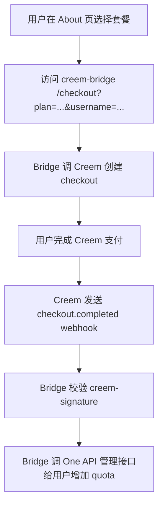

# Creem 自动充值执行清单

目标：用户在 NexaRelay / One API 前台选择充值档位，完成 Creem 支付后，系统自动给对应用户增加 quota。

## 0. 当前卡点

历史卡点：

```text
Bank payout verification
Waiting for sync
Continue your Paysway payout verification in a secure window.
```

这一步是商户结算账户验证。它会影响正式收款和打款能力，但不妨碍先设计产品档位、回调逻辑和人工补单兜底。

当前进度（2026-07-20）：

- 已在 Paysway 添加 `BANK OF CHINA` 的 USD 提现账户。
- 已回到 Creem 主后台。
- 实时支付仍未启用，当前应继续使用测试模式。
- 已开启测试模式。
- 已创建 3 个测试产品：Starter / Plus / Pro。
- 已进入开发者页面并创建测试 API Key。
- 已创建测试 Webhook，并全选事件。
- 测试阶段真正需要自动加 quota 的核心事件是 `checkout.completed`。
- 已登录 `https://api.getnexarelay.com/` 的 One API 后台检查支付相关配置。
- 后台 `运营设置` 只有 `充值链接`，当前为 `https://api.getnexarelay.com/about`。
- 后台 `系统设置` 未发现支付网关配置项。
- 后台 `其他设置` 的关于页已放置 Creem 产品直链，并说明 MVP 阶段人工加额度。
- `/topup` 充值页只有兑换码输入、获取兑换码、兑换按钮，未发现内置 Creem/Cream 支付配置。
- 当前结论：该 One API 实例没有可直接填写 Creem API Key / Webhook Secret / Product ID 的内置配置页，应按自定义 checkout + webhook 对接。

## 1. Creem 后台要准备的信息

在 Creem 验证完成后，记录这些值：

| 信息 | 用途 |
|---|---|
| Production API Key | 服务端创建 checkout session |
| Test API Key | 测试环境创建 checkout session |
| Webhook Secret | 校验 Creem 回调签名 |
| Starter Product ID | 1 USD -> 500,000 quota |
| Plus Product ID | 5 USD -> 2,800,000 quota |
| Pro Product ID | 10 USD -> 6,000,000 quota |

不要把 API Key 写进前端页面或公开仓库，只放到服务器环境变量。

## 2. 产品档位

建议先做一次性支付，不做订阅：

| 产品名 | Creem 价格 | 系统到账 |
|---|---:|---:|
| NexaRelay Starter Credits | 1 USD | 500,000 quota |
| NexaRelay Plus Credits | 5 USD | 2,800,000 quota |
| NexaRelay Pro Credits | 10 USD | 6,000,000 quota |

产品描述建议：

```text
One-time top-up for NexaRelay AI API quota. Credits are delivered to your account after payment confirmation.
```

## 3. Checkout 创建逻辑

创建 checkout 时必须带上内部用户标识，推荐放在 `metadata` 或 `request_id`：

```json
{
  "product_id": "prod_xxx",
  "request_id": "topup_USERID_TIMESTAMP",
  "success_url": "https://api.getnexarelay.com/topup/success",
  "metadata": {
    "userId": "one_api_user_id",
    "plan": "starter",
    "quota": "500000"
  }
}
```

Creem 返回 `checkout_url` 后，前端把用户跳转过去付款。

## 4. Webhook 到账逻辑

生产环境不要只信任 success URL。正确顺序：

1. 接收 Creem webhook。
2. 读取原始 request body。
3. 用 `creem-signature` header 和 webhook secret 做 HMAC-SHA256 校验。
4. 只处理支付成功事件，例如 `checkout.completed`。
5. 从 `metadata.userId` / `request_id` 找到内部用户。
6. 按 product id 映射 quota。
7. 写入充值订单表，要求 Creem event id 或 order id 幂等唯一。
8. 给用户增加 quota。
9. 返回 HTTP `200`。

幂等规则很重要：同一个 webhook 重试多次时，只能加一次 quota。

## 5. Webhook 地址

如果当前站点由 Cloudflare 代理，webhook 地址应保持公开 HTTPS 可达：

```text
https://api.getnexarelay.com/api/payment/creem/webhook
```

Creem 官方说明 webhook 没有固定来源 IP，不能依赖 IP 白名单；要靠 `creem-signature` 签名验证。

如果 Cloudflare Bot/WAF 拦截 webhook，需要给该路径加规则例外。

## 6. 测试流程

按这个顺序测试：

1. 在 Creem test mode 创建同样 3 个测试产品。已完成。
2. 配置 test webhook endpoint。已完成。
3. 用测试 API Key 创建 checkout。下一步。
4. 完成测试支付。
5. 确认 webhook 收到 `checkout.completed`。
6. 确认用户 quota 增加。
7. 重放同一个 webhook，确认不会重复加 quota。
8. 切换 production API Key、production product id、production webhook secret。
9. 用 Starter 做一笔真实小额支付。
10. 确认真实到账、真实加 quota、订单记录完整。

## 6.1 当前自动到账实现方案

已在本项目创建独立桥接服务：

```text
C:\Users\pglgl\Documents\chuhai4\creem-bridge
```

它不改 One API 主程序，而是作为外接服务：



桥接服务端点：

```text
GET  /health
GET  /checkout?plan=starter&username=ONE_API_USERNAME&email=user@example.com
POST /api/payment/creem/checkout
POST /api/payment/creem/webhook
```

需要部署到公开 HTTPS 域名，例如：

```text
https://pay.getnexarelay.com
```

Creem Webhook URL 应改为：

```text
https://pay.getnexarelay.com/api/payment/creem/webhook
```

One API About 页里的 Creem 直链后续改为桥接链接：

```text
https://pay.getnexarelay.com/checkout?plan=starter&username=用户填写的用户名
https://pay.getnexarelay.com/checkout?plan=plus&username=用户填写的用户名
https://pay.getnexarelay.com/checkout?plan=pro&username=用户填写的用户名
```

注意：自动到账必须知道 One API 用户是谁。MVP 阶段可以先让用户在购买链接里填写 `username`；更完整的版本再做登录态绑定或订单页面。

## 7. 人工补单兜底

在自动支付完全稳定前，保留一个手工表：

| 字段 | 说明 |
|---|---|
| 时间 | 用户付款时间 |
| 用户邮箱 / 用户 ID | One API 用户 |
| Creem order id | 支付订单 |
| 金额 | USD |
| 应加 quota | 500,000 / 2,800,000 / 6,000,000 |
| 处理状态 | pending / completed / failed |
| 处理人 | 操作者 |
| 备注 | 异常说明 |

## 8. 当前可立即执行

- One API 后台已确认没有可用的 Creem/Cream 内置支付配置项。
- 优先做自定义 webhook，因为当前站点是兑换码/外链充值模式。
- 记录三个测试产品的 Product ID，但不要把 API Key 或 Webhook Secret 写入公开文件。
- 在 One API 后台生成系统访问令牌：`设置 -> 个人设置 -> 生成系统访问令牌`。
- 将测试 API Key、Webhook Secret、Product ID、One API 系统访问令牌填到 `creem-bridge` 的服务器环境变量。
- 部署 `creem-bridge` 到公开 HTTPS 地址。
- 使用测试 API Key 创建第一笔 Starter checkout，验证是否能跳转 Creem 测试支付页。

## 9. 参考资料

- Creem API Introduction: `https://docs.creem.io/api-reference/introduction`
- Creem Checkout API: `https://docs.creem.io/features/checkout/checkout-api`
- Creem Create Checkout: `https://docs.creem.io/api-reference/endpoint/create-checkout`
- Creem Webhooks: `https://docs.creem.io/code/webhooks`
